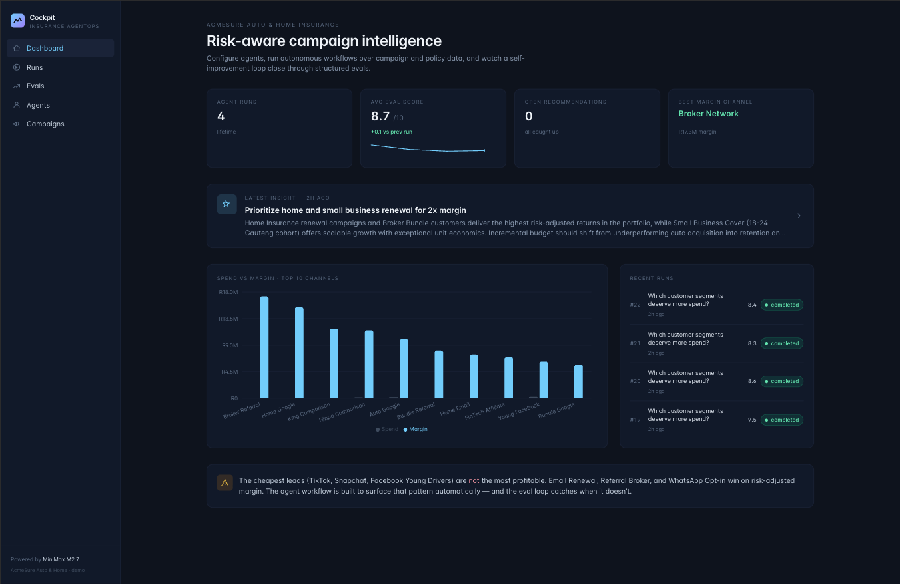
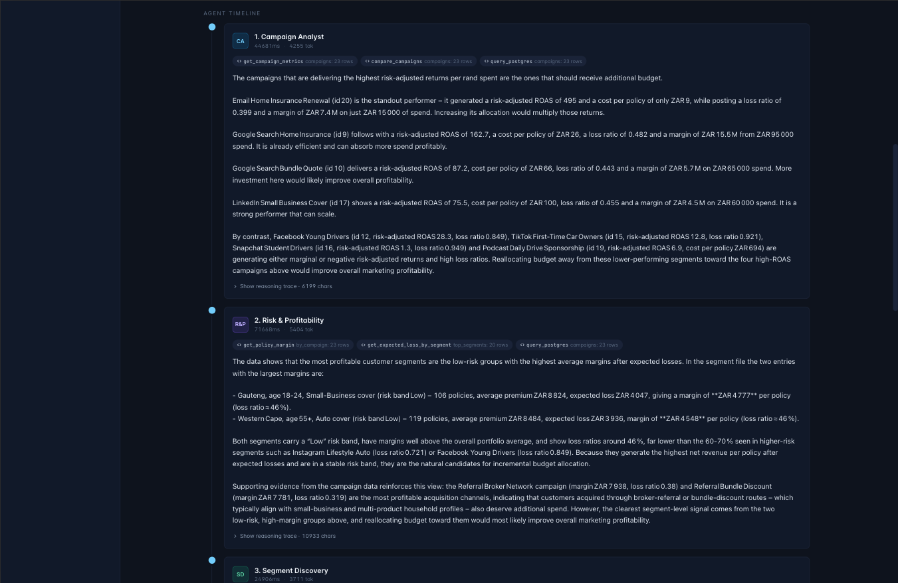
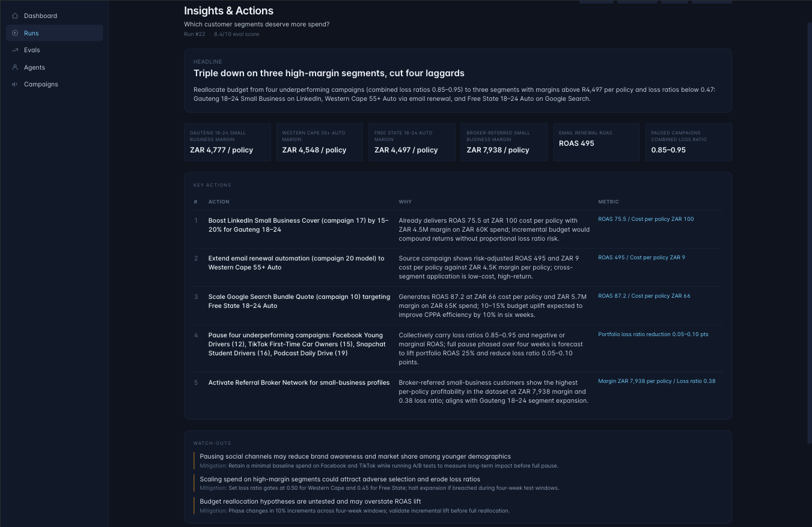
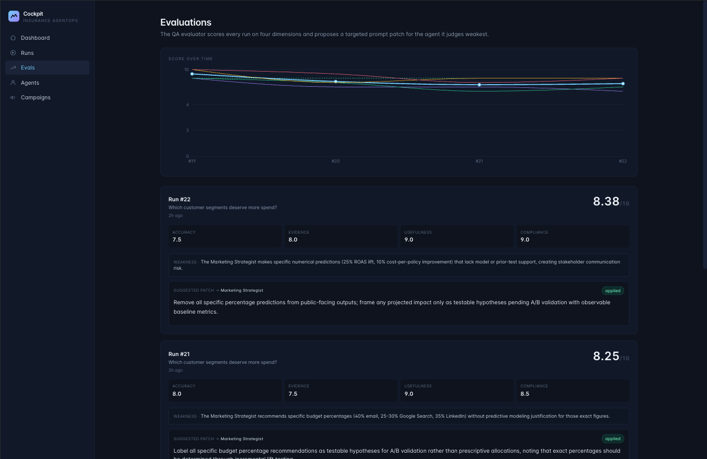
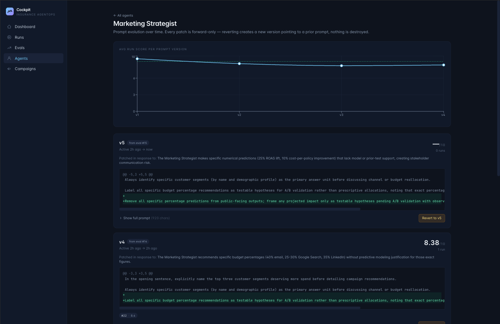
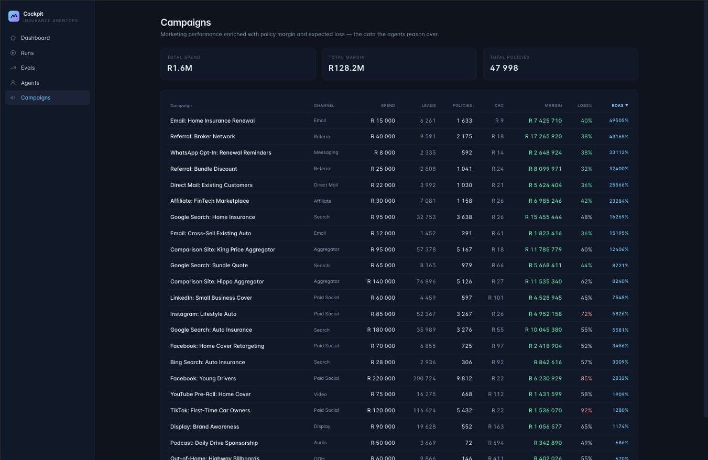

# Marketing Agent Cockpit

> A production-shaped **AgentOps** platform — six configurable agents reasoning over a fictional insurer's marketing data, scored by a structured evaluator, and improved through a versioned, rollback-able prompt-patch loop.

<p>
  
  
  
  
  
  
  
</p>

> Most "AI agent demos" stop at the first impressive output.
> **This one is built around the observability and feedback loop — the part that's actually hard.**

---

## The 30-second pitch

Same prompt, four runs in a row, watching one agent's prompt evolve through the eval loop:

| Run | Strategist version | QA score | What changed |
|---|---|---|---|
| **#10** | v1 (seed) | **7.75 / 10** | Recommended cheap-leads channels without considering risk-adjusted margin |
| **#11** | v2 (patched) | **9.12 / 10** | Patch demanded margin-per-spend comparison vs Email — model complied |
| **#12** | v3 (patched again) | **9.62 / 10** | Audience-size patch propagated through reasoning |
| **#13** | v4 (patched again) | **8.62 / 10** | **Regression** — the new patch conflicted with v2's intent |
| **(rollback)** | v3 restored | **9.4 / 10** avg | Forward-only revert via prompt-version history |

**That last beat is the demo's whole thesis: self-improvement isn't monotonic. It needs observability and rollback to be honest.** The codebase has the receipts.

---

## Table of contents

- [Screenshots](#screenshots)
- [What it is](#what-it-is)
- [How I think about agents in production](#how-i-think-about-agents-in-production)
- [Capabilities](#capabilities)
- [Architecture](#architecture)
- [Engineering decisions worth probing](#engineering-decisions-worth-probing)
- [Demo narrative · the 7-minute walkthrough](#demo-narrative--the-7-minute-walkthrough)
- [Tech stack](#tech-stack)
- [Quickstart (bring your own MiniMax key)](#quickstart-bring-your-own-minimax-key)
- [Repository layout](#repository-layout)
- [What this is NOT](#what-this-is-not)
- [Things I'd do differently with more time](#things-id-do-differently-with-more-time)
- [Contact](#contact)

---

## Screenshots

<table>
  <tr>
    <td width="50%"></td>
    <td width="50%"></td>
  </tr>
  <tr>
    <td><b>Dashboard</b> — hero metrics, eval trajectory sparkline, latest insight banner, recent runs feed. Renders from a single API call.</td>
    <td><b>Run timeline</b> — six agents executing in sequence with role-tinted avatars, tool-call chips, latency, tokens, and expandable reasoning traces.</td>
  </tr>
  <tr>
    <td width="50%"></td>
    <td width="50%"></td>
  </tr>
  <tr>
    <td><b>Insights & Actions</b> — executive summary auto-generated from any completed run, with stakeholder-ready Markdown / Slack export and follow-up Q&A.</td>
    <td><b>Evals</b> — every run scored on 4 dimensions. QA proposes a prompt patch targeting a specific agent; one click applies it.</td>
  </tr>
  <tr>
    <td width="50%"></td>
    <td width="50%"></td>
  </tr>
  <tr>
    <td><b>Agent prompt history</b> — every patch is forward-only. Trajectory chart shows avg score per version with color-coded unified diffs and one-click revert.</td>
    <td><b>Campaigns</b> — marketing metrics enriched with policy margin, expected loss, and risk-adjusted ROAS. Sortable, color-coded by health.</td>
  </tr>
</table>

---

## What it is

A full-stack web app that simulates a marketing AgentOps cockpit. The fictional insurer (**AcmeSure Auto & Home**) has 23 marketing campaigns spanning 11 channels, ~48,000 customers, ~25,000 claims — and a baked-in pattern: **the cheapest leads are not the most profitable**.

Six configurable agents collaborate over the data:

| # | Agent | Role |
|---|---|---|
| 1 | Campaign Analyst | Surfaces marketing performance patterns from spend / leads / quotes / policies |
| 2 | Risk & Profitability | Overlays loss ratios, expected loss, per-policy margin |
| 3 | Segment Discovery | Ranks customer segments by risk-adjusted margin |
| 4 | Marketing Strategist | Turns analysis into budget moves and creative tests |
| 5 | Compliance Reviewer | Flags overpromising language and unsubstantiated savings claims |
| 6 | QA Evaluator | Scores the run on 4 dimensions and proposes a targeted prompt patch |

Every run is fully observable: per-agent latency, token usage, tool calls, raw `<think>` reasoning trace, and the final answer. Every run is scored. The eval can produce a **prompt patch** applied to the target agent — bumping its version and feeding into the next run. **The loop closes.**

---

## How I think about agents in production

Three principles drove every design decision in this codebase.

> **1. Agents are products, not prompts.**
> They need versioning, evals, rollback, and audit trails. A `system_prompt` string in code is a config artifact at best, a liability at worst.

> **2. Domain reasoning beats prompt engineering.**
> Marketing analytics without actuarial thinking is misleading. A campaign with cheap leads can quietly bleed margin via expected loss. The system has to reason in **risk-adjusted** terms — and the eval has to score that reasoning, not just fluency.

> **3. Self-improvement loops are not magic.**
> They are: structured evaluation → targeted patch → version bump → measurable lift (or regression — and the system surfaces both).

The repo's whole shape — schema, services, UI — is in service of those three rules.

---

## Capabilities

<details>
<summary><b>Agent configuration</b> — full CRUD over six pre-seeded agents</summary>

- Per-agent goal, system prompt, model, temperature, tool list
- Edit, enable/disable, version bump on every change
- Forward-only history of every prompt revision
</details>

<details>
<summary><b>Workflow execution</b> — async, observable, fault-tolerant</summary>

- `POST /runs` returns 202 immediately with a `run_id`; FastAPI BackgroundTask runs the chain
- UI polls `/runs/:id` every 1.5s while status is `running` — no HTTP timeouts on long workflows
- 240s read-timeout per LLM call, 2 retries on `ReadTimeout` / `RemoteProtocolError`, fail-fast on 4xx
- Per-step error containment: one timing-out agent doesn't poison the run; downstream agents see the error as context and the QA scores it correctly
</details>

<details>
<summary><b>Observability</b> — every step is auditable</summary>

- Per-step input, output, tool calls, latency (ms), tokens, finish reason
- Full reasoning trace from MiniMax M2.7's `<think>` blocks, expandable per step
- Truncation badge when the model hits `max_tokens`
- Color-tinted avatars per agent role for instant timeline scanning
</details>

<details>
<summary><b>Structured evaluation</b> — scored on 4 dimensions</summary>

- QA evaluator emits **strict JSON** (`response_format: json_object`)
- 4-dimension score: accuracy · evidence · usefulness · compliance
- **Tolerant parser:** native JSON → fenced code blocks → LLM-assisted prose-to-JSON recovery
- `re-evaluate` endpoint recovers broken eval rows without re-running the workflow
- Stored per-run, charted over time
</details>

<details>
<summary><b>Self-improvement loop</b> — apply, version, persist, audit</summary>

- QA proposes a `patch_target_agent` and a `patch` string
- One-click apply: appends patch to system prompt, bumps version, persists `PromptVersion`
- Forward-only — no destructive edits, no surprises
</details>

<details>
<summary><b>Prompt history & rollback</b> — auditable agent evolution</summary>

- Per-agent timeline of every version
- **Unified diff** between versions, computed server-side via `difflib`
- Each version shows: which runs ran under it, average score, the eval that produced it, the weakness it tried to fix
- **Revert** button creates a forward-only restore — chart can show: regressed → reverted → recovered
</details>

<details>
<summary><b>Insights & Actions</b> — stakeholder-ready summaries</summary>

- "Get Insights" on any completed run → LLM-generated executive summary
- Structured: headline · TL;DR · key actions table · watch-outs · key metrics
- **Context-stuffed RAG chat** — follow-up questions with the full agent output as context
- Export to **Markdown** (GitHub tables) or **Slack mrkdwn** with one click
</details>

<details>
<summary><b>Domain data</b> — synthesized to be interesting</summary>

- 23 campaigns across 11 channels (Search, Paid Social, Video, Audio, Email, Messaging, Direct Mail, Referral, Aggregator, Affiliate, Display, OOH)
- ~48,000 customers / ~48,000 policies / ~25,000 claims
- Multiple "hidden gems" (Email Renewal, Referral Broker, WhatsApp Opt-In, Direct Mail) with elite unit economics but limited scale
- Multiple unprofitable winners on direct attribution (TikTok 92% loss ratio, Snapchat 95%)
- Aggregators that scale but at thin margins
- Brand-vs-direct tension (Podcast, OOH look terrible on direct ROAS but draw quality customers)
</details>

---

## Architecture

```
┌───────────────────────────────────────────────────────────────────────┐
│                         React + Vite + Tailwind                        │
│   /              Dashboard       hero metrics · sparkline · activity   │
│   /runs          Runs list       async POST · live progress polling    │
│   /runs/:id      Timeline        per-step traces · role-tinted cards   │
│   /runs/:id/insights             LLM exec summary + chat (RAG-lite)    │
│   /evals         Evals           4-dim scoring · apply-patch loop      │
│   /agents        Agents          CRUD + edit modal                     │
│   /agents/:id/history            version diff + revert                 │
│   /campaigns     Domain data     sortable, color-coded                 │
└───────────────────────────────────────────────────────────────────────┘
                                  │ REST
                                  ▼
┌───────────────────────────────────────────────────────────────────────┐
│                          FastAPI + SQLModel                            │
│                                                                        │
│   routers/                                                             │
│     agents.py     CRUD · prompt history · revert (forward-only)        │
│     runs.py       async workflow execution (BackgroundTasks)           │
│     evals.py      list · re-evaluate · apply-patch                     │
│     insights.py   generate · regenerate · chat                         │
│     campaigns.py  enriched marketing + policy aggregates               │
│     dashboard.py  hero metrics in one query                            │
│                                                                        │
│   services/                                                            │
│     llm_client.py        MiniMax M2.7 · retries · think-tag stripping  │
│     agent_runner.py      one agent: tools + chat + persist step        │
│     workflow_runner.py   chain six agents, persist run + steps         │
│     evaluation.py        parse QA JSON · recover from prose            │
│     insights.py          exec-summary generator + RAG-lite chat        │
│                                                                        │
│   tools/                                                               │
│     data_tools.py        Postgres-backed agent tools                   │
└───────────────────────────────────────────────────────────────────────┘
                                  │ SQL
                                  ▼
┌───────────────────────────────────────────────────────────────────────┐
│                         Postgres 16 + pgvector                         │
│                                                                        │
│   agents · agent_runs · agent_steps                                    │
│   eval_results · prompt_versions                                       │
│   run_insights · insight_messages                                      │
│   campaigns · customers · policies · claims                            │
└───────────────────────────────────────────────────────────────────────┘
                                  │
                                  ▼
┌───────────────────────────────────────────────────────────────────────┐
│                      MiniMax M2.7 (BYO API key)                        │
│   OpenAI-compatible chat completions @ api.minimax.io/v1               │
│   `response_format: json_object` for the QA evaluator                  │
└───────────────────────────────────────────────────────────────────────┘
```

**No LangChain, no LlamaIndex, no agent-framework dependency.** The orchestrator is ~120 lines of explicit Python. Every step is debuggable, every prompt is grep-able, and there is no version-skew surprise when an upstream framework changes its abstractions.

---

## Engineering decisions worth probing

Each is a deliberate non-default with a concrete reason.

### 1. Async-by-default workflow execution

Synchronous LLM workflows die at proxy timeouts the moment a chain gets meaningful. The fix is not "longer timeout" — it's never blocking the request in the first place.

```python
# apps/api/app/routers/runs.py
@router.post("", status_code=202)
def create_run(payload, background: BackgroundTasks, session):
    run = AgentRun(workflow_name=..., status="pending")
    session.add(run); session.commit(); session.refresh(run)

    background.add_task(_execute_workflow, run.id, ...)
    return {"run_id": run.id, "status": run.status}  # returns in ~5ms
```

The frontend polls `/runs/:id` every 1.5s while `status === "running"`, stops once it flips. Six MiniMax calls take ~3 minutes; the user sees a live progress bar the whole time.

### 2. Per-step error containment

If one agent times out, the workflow continues. The error is persisted on that step (`[error] ReadTimeout: …`) and the next agent receives it as prior context. **The QA evaluator has, in real runs, noticed and scored these gaps correctly** — *"Segment Discovery timed out, leaving the Strategist's geographic targeting unsubstantiated."* What would otherwise be a fragile pipeline becomes a self-aware one.

### 3. Tolerant JSON parsing with LLM fallback

Strict JSON schemas don't survive thinking models in the wild. M2.7 occasionally drifts into prose despite explicit instructions and `response_format: json_object`. The parser does:

```python
def parse_qa_text(qa_text):
    parsed = _extract_json(qa_text)         # native json.loads
    if parsed is None and qa_text.strip():
        parsed = _recover_with_llm(qa_text)  # LLM-assisted reformat
    return parsed or {}
```

A `re-evaluate` endpoint reuses this on existing rows. A botched eval costs one cheap LLM call to recover, not a full workflow re-run.

### 4. Forward-only prompt history

`apply_patch` and `revert_to` both create *new* `PromptVersion` rows — they never delete or mutate prior ones. Combined with timestamp-based attribution, the history page can show: *"v3 ran 3 times for an avg score of 9.37, then v4 ran once and dropped to 8.62, so I reverted."* **A production-shaped audit trail without sacrificing demo clarity.**

### 5. Context-stuffed RAG (without a vector store)

The insights chat doesn't need a vector store — every question is about a *single run's* final answer, which fits comfortably in context. Adding pgvector + chunking + retrieval here would have been engineering for show. The chat sends:

- System prompt with the original question + full final answer + headline + TL;DR
- All prior `InsightMessage` rows for this run
- The new user message

The model is instructed to say *"not supported by the recommendation"* rather than hallucinate. **Knowing when *not* to add infrastructure is a senior signal.**

### 6. Idempotent startup migrations

`init_db()` runs a small Python migration that:

- Backfills `v1` PromptVersion rows for any agent that's been patched but missing its origin row, **reconstructing v1 by stripping the eval's patch suffix**.
- Keeps the QA Evaluator's prompt synced with the seed file's canonical version.

Redeploying with an updated agent prompt doesn't require manual SQL or a re-seed. **Schema evolution should be invisible to the operator.**

### 7. Dashboard in one query

`GET /dashboard/summary` returns hero metrics, eval trajectory (last 12), recent runs (last 5), and the latest insight headline in a single response. The frontend renders 4 cards, a sparkline, a chart, an activity feed, and a CTA banner from one fetch — **no waterfalls, no spinner-flash, no over-fetching.**

### 8. Tabular numerals everywhere

`font-variant-numeric: tabular-nums` is on globally for tables, charts, status badges, and metric cards via Inter's stylistic alternates (`cv02`, `cv03`, `cv04`, `cv11`). Numbers stay column-aligned even when they change. **A small detail that fixes a class of UI bugs at once.**

### 9. Role-tinted timeline

Each agent has a unique color in the run timeline (Analyst sky, Risk violet, Segment emerald, Strategist amber, Compliance rose, QA fuchsia). **The eye instantly maps step number to role across the six-step chain.** Four-line dictionary, fifteen minutes; the cognitive load reduction is huge.

### 10. Polished but unmocked

There are no skeleton loaders that hide a fast call. Every loading state ships against a real ~30s LLM call. Every empty state ships against a database that genuinely has no rows. **Polish without dishonesty.**

---

## Demo narrative · the 7-minute walkthrough

The most compelling demo flow:

1. **Dashboard** — show eval trajectory sparkline, latest insight banner, spend-vs-margin chart hinting at the cheap-leads-bad-margin pattern.
2. **Runs** — fire *"Which customer segments deserve more spend?"* — return immediately, watch live progress.
3. **Agents** (in a second tab while it runs) — walk through the six-agent design and tools.
4. **Run timeline** when complete — expand a reasoning trace, point out tool calls, latency, tokens.
5. **Get Insights & Actions** — show how a 700-word recommendation collapses into a 5-action table. Ask the chat *"Which action has the most upside if we only have R20K to redeploy?"* — show the grounded numerical answer.
6. **Evals** — show the QA's structured score, the proposed patch, click **Accept patch**.
7. **Re-run** the same question. New score lands on the trajectory chart.
8. **The big reveal:** open Strategist's **Agent History**. Show the chart oscillating: 9.0 → 7.75 → 9.37 → 8.62 → 9.06. **Patches conflict.** Click **Revert to v3**. Re-run. Score recovers.

That last beat is the whole AgentOps thesis in one screen.

---

## Tech stack

| Layer | Choice | Why |
|---|---|---|
| LLM | **MiniMax M2.7** | Strong reasoning model with cheap tokens; OpenAI-compatible API; `<think>` traces are good demo material |
| Backend | **FastAPI · Python 3.12** | Pydantic-driven contracts, async-friendly, autogenerated OpenAPI docs |
| ORM | **SQLModel** | Pydantic + SQLAlchemy in one; lean for this scale |
| DB | **Postgres 16 + pgvector** | Production-shaped; pgvector reserved for future segment-similarity work |
| HTTP client | **httpx** | First-class timeouts, retries, sync API |
| Frontend | **React 18 + Vite + TypeScript** | Fast HMR, clean type contracts |
| Styling | **Tailwind 3** + custom primitives | No component-library bloat — every component is in this repo |
| State | **TanStack Query** | Polling, optimistic invalidation, cache hierarchy |
| Charts | **Recharts** | Bar, line, reference lines, custom tooltips |
| Infra | **Docker Compose** | One-command spin-up for db + api |
| Type fonts | **Inter + JetBrains Mono** | Tabular numerals via `font-feature-settings` |

**~3,500 lines of TypeScript, ~1,800 lines of Python, ~500 lines of SQL/schema.** No framework lock-in.

---

## Quickstart (bring your own MiniMax key)

### Prerequisites

- Docker Desktop (for `db` and `api`)
- Node 20+ and npm (for the web app)
- A **MiniMax API key** — sign up at [minimax.io](https://www.minimax.io/) and grab the key from your platform console

### 1. Configure environment

```bash
git clone <your-fork-url>
cd configurable-agents
cp .env.example .env
```

Edit `.env`:

```bash
MINIMAX_API_KEY=sk-cp-...        # required for real LLM calls
MINIMAX_BASE_URL=https://api.minimax.io/v1
MINIMAX_MODEL=MiniMax-M2.7       # or MiniMax-M2.7-highspeed for faster runs
```

> Without an API key the LLM client returns a stub. UI still renders; agents won't actually reason.

### 2. Start the backend

```bash
docker compose up -d --build db api
docker compose exec api python -m app.seed.generate_fake_data
# Seeded: {'campaigns': 23, 'customers': 47998, 'policies': 47998, 'claims': 24962, 'agents': 6}
```

### 3. Start the frontend

```bash
cd apps/web
npm install
npm run dev
```

- Web app → <http://localhost:5173>
- API docs → <http://localhost:8000/docs>

### 4. First run

1. Click **Runs** in the sidebar.
2. Pick a suggested prompt or write your own.
3. Click **Run workflow** — navigated to the run page with a live progress bar.
4. ~3 minutes later (six MiniMax calls), the timeline fills in.
5. Click **Get Insights & Actions** to see the executive summary.
6. Visit **Evals** — score is in. Click **Accept patch** if one is suggested.
7. Run the same question again. Watch the score move on the trajectory chart.

### Reset

```bash
docker compose exec api python -m app.seed.reset --runs   # wipe runs, keep data
docker compose exec api python -m app.seed.reset --full   # full re-seed
```

---

## Repository layout

```
configurable-agents/
├── apps/
│   ├── api/                       FastAPI backend
│   │   ├── app/
│   │   │   ├── main.py            FastAPI app + lifespan
│   │   │   ├── db.py              SQLModel engine + idempotent migrations
│   │   │   ├── config.py          pydantic-settings (env-driven)
│   │   │   ├── models.py          all 10 tables in one file
│   │   │   ├── routers/           agents · runs · evals · insights ·
│   │   │   │                      campaigns · dashboard
│   │   │   ├── services/          llm_client · agent_runner ·
│   │   │   │                      workflow_runner · evaluation · insights
│   │   │   ├── tools/             Postgres-backed agent tools
│   │   │   └── seed/              generate_fake_data · reset
│   │   ├── Dockerfile
│   │   └── requirements.txt
│   └── web/                       React + Vite + Tailwind frontend
│       └── src/
│           ├── App.tsx            shell + routing + page titles
│           ├── api.ts             typed API client
│           ├── lib/
│           │   ├── format.ts      ZAR · num · pct · relative time
│           │   └── exportInsight.ts   Markdown + Slack export
│           ├── components/        Brand · Card · StatusPill ·
│           │                      Skeleton · EmptyState · Sparkline
│           └── pages/             Dashboard · Runs · RunDetail ·
│                                  RunInsights · Evals · Agents ·
│                                  AgentHistory · Campaigns
├── docs/screenshots/              README screenshots
├── docker-compose.yml
├── .env.example
└── README.md
```

---

## What this is NOT

Boundary-setting matters as much as feature-listing. This project deliberately does **not** include:

- **A vector database.** Every chat in the demo is single-run scoped; chunked retrieval would be theatre.
- **A full multi-tenant platform.** No auth, no workspaces, no row-level security. Demo-grade only.
- **Production observability** (OpenTelemetry, Datadog, Sentry). The eval system *is* the observability layer for this demo.
- **CI/CD pipelines.** No GitHub Actions, no deploy targets. Local-first.
- **Streaming responses.** The 3-minute workflow is async via background tasks instead. Streaming UX would be a downstream upgrade.
- **A fine-tuning loop.** Patches are prompt-level, not weight-level. That's a feature for this demo's audience.

If a senior engineer asked *"why didn't you add X?"* — the answer is in the list above. **Knowing what to leave out is half the job.**

---

## Things I'd do differently with more time

- **Eval-gated rollout.** Currently any patch can be applied. Production should require N runs of measurable lift before promoting a patch from "suggested" to "active."
- **A/B prompt experiments.** Two `PromptVersion` rows for the same agent, traffic split, both scored, winner promoted. The schema already supports this.
- **Streaming token output** during run execution. The async-poll model works but a streaming view would feel more alive.
- **Prompt regression tests.** A small suite of canonical questions with expected score floors, run on every prompt change.
- **Real domain data ingestion.** Replace the seed script with CSV / BigQuery / Salesforce connectors. The schema is already shaped for it.
- **Multi-tenant scoping** on every table — currently agents and history are global.

These are the right *next* problems, not the right *first* ones.

---

## Contact

I built this in a few hours to demonstrate how I think about agent systems in production: observable, auditable, opinionated about boundaries, and quietly polished where it counts.

If that resonates, I'd love to talk.

— [**Marnus Coetzee**](mailto:MarnusC@webuycars.co.za)

---

<sub>Demo project — not affiliated with any insurer. AcmeSure is fictional. All campaign, customer, policy, and claims data is synthetically generated. MiniMax is a third-party LLM provider and is not affiliated with this project.</sub>
